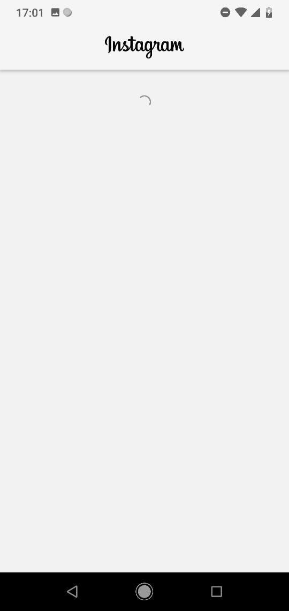
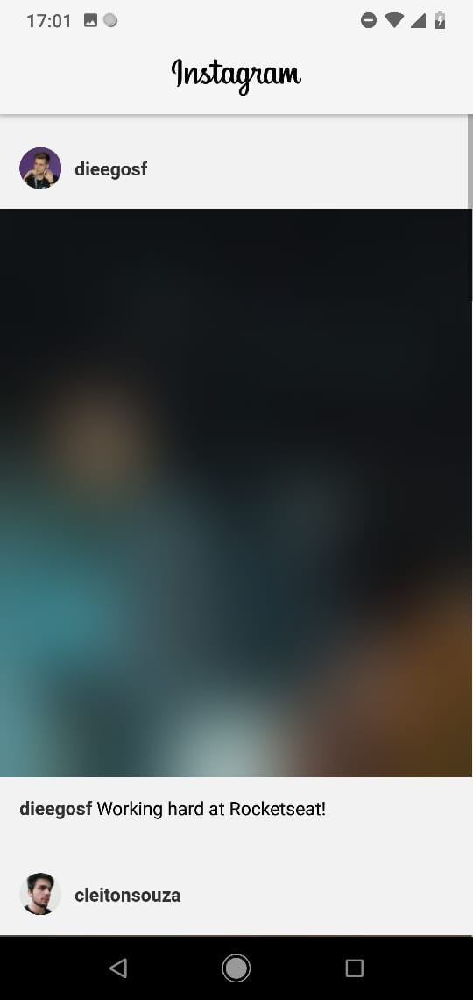
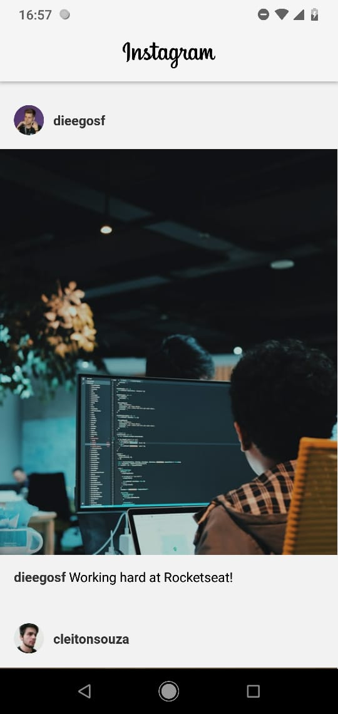
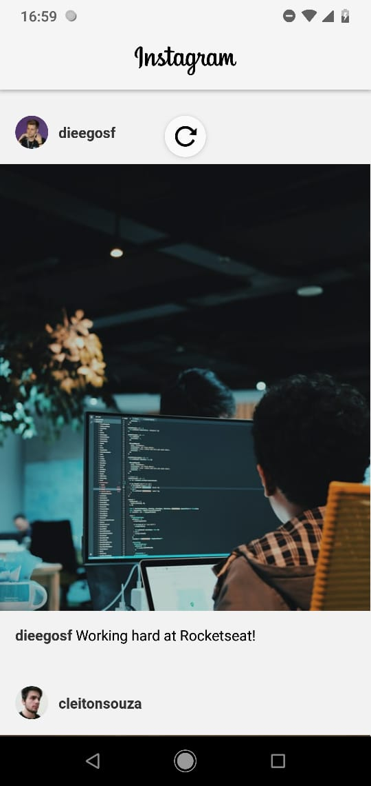

# InstagramCopy
Cópia do instagram com base no vídeos de nome similar da RocketSeat

#### Instruções para execução do código no fim do README

## Loading Page

## Blur Page

## Loading Screen

## Loading Spinner

# Comandos para funcionar

<ol>
        <li> Primeiramente, use yarn react-native start </li>
        <li> Use adb devices para descobrir o id do seu celular </li>
        <li> Em outro terminal, com o celular conectado via USB use o comando:
                yarn react-native run-android --deviceId={Id do seu celular} </li>
        <li> Em uma outra instância do terminal execute yarn json-server server.json -d 1000 -w
                isso fará com que o server.json execute na porta 3000 como um servidor </li>
</ol>
